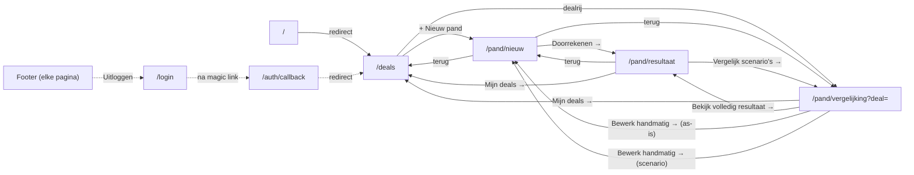

# Navigatie-inventaris — WWSO Scenario App

Bron: codelezing van elke route in `apps/web/src/app/` plus de daarin gerenderde componenten,
aangevuld met live browser-checks voor de runtime-only vragen (verse tab op een diepe URL,
browser-back-gedrag). Geen crawler gebruikt — bij 7 routes levert dat niets extra op.

Peildatum: 2026-09-04, versie v0.5.6 (na de fixes uit `RAPPORT_navigatie-audit_2026-09-04.md`).

## Routetabel

| Route | Titel (browsertab) | Titel (in pagina) | Bereikbaar vanaf |
|---|---|---|---|
| `/` | WWSO Scenario App | — (geen UI, redirect) | Elke ingetypte root-URL |
| `/login` | WWSO Scenario App | "WWSO Scenario App" (h1, herhaalt de tabtitel) | Auto-redirect bij niet ingelogd (middleware, geen klik) |
| `/auth/callback` | — (geen UI, route handler) | — | Link in de magic-link-e-mail |
| `/deals` | WWSO Scenario App | "Mijn deals" | Topbar ("Mijn deals"), Vergelijking ("Mijn deals →"), lege-staat-links op resultaat/vergelijking, na inloggen (default `volgende`) |
| `/pand/nieuw` | WWSO Scenario App | geen los paginatitel-element — Topbar toont `🏠 {adres of "Nieuw pand"}` | `/deals` ("+ Nieuw pand", lege-staat-link), Vergelijking ("Bewerk handmatig →", AS-IS en scenariokolommen) |
| `/pand/vergelijking` | WWSO Scenario App | "Scenariovergelijking" | `/pand/nieuw` (Doorrekenen), `/deals` (dealrij-link), Resultaatscherm ("Vergelijk scenario's →") |
| `/pand/resultaat` | WWSO Scenario App | `{adres van het pand}` | `/pand/nieuw` (Doorrekenen/Gebruik als scenario), Vergelijking ("Bekijk volledig resultaat →", AS-IS en scenariokolommen) |

**Bevinding (Fase 2, wayfinding):** de browsertab-titel is op élke pagina identiek ("WWSO Scenario
App") en verandert nooit — niet bij een specifiek pand, niet bij een deal-naam. Bij meerdere open
tabs (bijv. twee deals naast elkaar vergelijken) is er dus geen enkele manier om ze in de
tabbalk uit elkaar te houden. De in-pagina-titels (h1 / Topbar-adres) zijn wél correct en
dynamisch — het is specifiek de `<title>` (Next.js `metadata`, nu hardcoded in `layout.tsx`,
geen enkele route-`page.tsx` overschrijft 'm) die geen orientatie geeft.

## Navigatie-affordances per pagina

### `/deals`
| Label | Type | Bestemming | Positie |
|---|---|---|---|
| "+ Nieuw pand" | Link | `/pand/nieuw` | Header |
| "een nieuw pand" (inline in lege-staat-tekst) | Link | `/pand/nieuw` | In-content (alleen als 0 deals) |
| Deal-naam (tabelrij) | Link | `/pand/vergelijking?deal=<id>` | In-content (tabel) |
| Map-filter | `<select>` | — (filtert dezelfde pagina, geen navigatie) | Header |

### `/pand/nieuw` (Topbar, zichtbaar op elke sectie)
| Label | Type | Bestemming | Positie |
|---|---|---|---|
| "① Pand" / "② Ruimten" / "③ Overige posten" | `<a href="#...">` | In-page scroll-anker, geen echte navigatie | Header (sticky) |
| "Mijn deals" | Link | `/deals` | Header |
| "Opslaan" / "Deal opslaan" | Button | — (actie: opslaan, geen navigatie) | Header |
| "Doorrekenen →" / "Gebruik als scenario →" | Button | `/pand/resultaat` (sessionStorage) of `handmatigScenario.terugUrl` | Header |
| "Alles wissen" | Button | — (actie: wist lokale state, met confirm-dialoog) | Header (alleen als er al ruimtes zijn) |
| "← Terug naar de vergelijking" / "← Terug naar mijn deals" | Link | `/pand/vergelijking` resp. `/deals` | In-content (alleen bij ongeldige `?deal=`/`?scenario=`) |

### `/pand/vergelijking`
| Label | Type | Bestemming | Positie |
|---|---|---|---|
| "Opslaan" / "Deal opslaan" | Button | — (actie: opslaan, geen navigatie) | Header |
| "Mijn deals →" | Link | `/deals` | Header |
| Map-select / "Naam nieuwe map"-veld | `<select>`/`<input>` | — (geen navigatie) | Header |
| "Bekijk volledig resultaat →" (AS-IS-kolom) | Button | `/pand/resultaat?deal=<id>` (met dealId) of sessionStorage-only | In-content |
| "Bewerk handmatig →" (AS-IS-kolom) | **Link** | `/pand/nieuw?deal=<id>` | In-content |
| "Bekijk volledig resultaat →" (scenariokolom) | Button | `/pand/resultaat` (sessionStorage) | In-content |
| "Bewerk handmatig →" (scenariokolom) | **Button** | `/pand/nieuw?scenario=<index>` (sessionStorage) | In-content |
| "Leegmaken" (scenariokolom) | Button | — (actie: wist die kolom, geen navigatie) | In-content |
| "← Terug naar het invoerscherm" / "Mijn deals →" | Link | `/pand/nieuw` resp. `/deals` | In-content (alleen bij ontbrekende invoer) |

### `/pand/resultaat`
| Label | Type | Bestemming | Positie |
|---|---|---|---|
| "PDF downloaden" | Button | — (actie: download, geen navigatie) | Header |
| "Vergelijk scenario's →" | Link | `terugUrl` (`/pand/vergelijking` of `/pand/vergelijking?deal=<id>`) | Header |
| Kamerrij (accordion) | Button | — (klap open/dicht, geen navigatie) | In-content |
| "← Terug naar het invoerscherm" / "Mijn deals →" | Link | `/pand/nieuw` resp. `/deals` | In-content (alleen bij ontbrekende invoer) |

### Overal (Footer, `layout.tsx`, elke pagina)
| Label | Type | Bestemming | Positie |
|---|---|---|---|
| "WWSO Scenario App · v{versie}" | Button | — (klapt wijzigingslog uit/in, geen navigatie) | Footer |
| "Uitloggen" (alleen als ingelogd) | Button | `/login` (na `signOut()`) | Footer |

## Graaf

## Berekende metrieken

- **Orphans:** geen. Elke route is vanaf minstens één andere, zelf bereikbare pagina gelinkt.
  `/login` is een uitzondering qua *type* bereikbaarheid — je komt er nooit via een klik in de
  UI, alleen via een geforceerde middleware-redirect zodra je niet ingelogd bent, of via
  "Uitloggen". Geen orphan, wel een aparte categorie.
- **Dead ends** (geen uitgaande navigatie behalve browser-back): alleen `/login` — met opzet,
  er is niets om naar terug te gaan vóór authenticatie. Alle overige pagina's hebben minstens één
  navigatie-affordance.
- **Diepte** vanaf `/deals` (de effectieve startpagina na de `/`-redirect):
  - `/pand/nieuw`: 1 klik
  - `/pand/vergelijking`: 1 klik (rechtstreeks vanaf de dealrij in `/deals`)
  - `/pand/resultaat`: 2 klikken (via `/pand/nieuw` of via `/pand/vergelijking`)
  - `/login`: 0 klikken indien niet ingelogd (startpunt), anders alleen via "Uitloggen"
- **Dubbele affordances:**
  1. **"Bewerk handmatig →" wijst naar twee verschillende bestemmingen** afhankelijk van kolom:
     `/pand/nieuw?deal=<id>` (AS-IS, bewerkt de opgeslagen deal) vs. `/pand/nieuw?scenario=<index>`
     (scenariokolom, bewerkt een tijdelijke mutatie). Zelfde label, andere semantiek — en zoals
     Fase 3 hieronder laat zien, ook een ander HTML-element.
  2. **"Mijn deals" vs. "Mijn deals →"** — zelfde bestemming (`/deals`), inconsistente pijl. Kleine
     inconsistentie, geen functioneel probleem.
  3. **"Bekijk volledig resultaat →"** is consistent (altijd `/pand/resultaat`, altijd een
     `<button>`) — géén dubbele affordance, ter correctie van een eerdere (foutieve) aanname in de
     lean-versie van deze audit.

## Fase 3 — Labelling

Alle navigatie-labels in de app (zie tabellen hierboven) beschrijven hun bestemming redelijk tot
goed — geen misleidende labels gevonden ("Mijn deals" → deals-overzicht, "PDF downloaden" →
download, etc.).

**Element/gedrag-mismatches (breekt toetsenbord-/screenreader-verwachtingen):**
- "Bewerk handmatig →" is voor de AS-IS-kolom een echte `<Link>` (`SamenvattingRij.tsx:150`),
  maar voor een scenariokolom een `<button onClick=...>` (`SamenvattingRij.tsx:164`). Een
  screenreader-gebruiker die op "link" navigeert (bijv. met de link-lijst-shortcut) mist de
  scenariokolom-variant volledig, want die is geen link.
- Alle overige navigerende affordances die ook een side effect uitvoeren vóór het navigeren
  (opslaan, sessionStorage wegschrijven) zijn consequent `<button>` — dat is correct gedrag, geen
  mismatch. Het is specifiek de inconsistentie tussen de twee "Bewerk handmatig →"-varianten die
  opvalt, omdat ze verder identiek ogen.

**Terminologie:** "pand" (het object dat wordt doorgerekend) en "deal" (de opgeslagen record)
worden overal consistent als twee verschillende begrippen gebruikt — geen wisselende synoniemen
voor hetzelfde concept gevonden. "Woning" komt nergens voor als los begrip.
